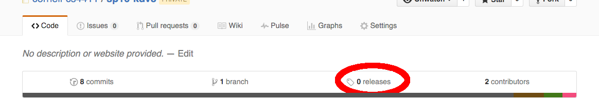
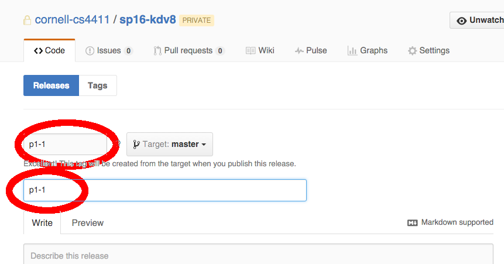

CS 4411 Practicum in Operating Systems Spring 2016
___

#Project 1: Non-Preemptive Multithreading
***Note:*** This project description is subject to change. We recommend refreshing this page regularly.
Here is an online [FAQ](FAQ.md) you may find helpful. Also please check [Piazza](https://piazza.com/class/ijzyrk21o9re6) regularly.

##Overview
Your task in this project is to write a non-preemptive user-level threads package. Most operating systems provide such a lightweight
thread abstraction because, as you might recall from the lectures and the reading, user-level threads provide concurrency with very
low-overhead. Your task is to write one.

We have provided you with some skeletal code that creates an environment on top of Linux that closely resembles the environment on
top of raw hardware shortly after booting. We use our host OS to provide us with a virtual processor and memory.  It also bootstraps
our kernel; that is, it loads it into memory and starts executing it at its entry point. Your task is to build high-level abstractions
on top of this environment in the same manner the host OS builds its abstractions on top of the hardware.

##Project Structure
The project can be roughly split into three parts:
###Foundation
You are required to build two basic data structures that will be needed for a proper implementation of the `minithread`.
This part issupposed to help you refresh your C skills, before you get to the hard part.

First, you will need to implement a FIFO queue. We will be relying on this queue implementation throughout the rest of the semester,
so it's important that the implementation be efficient. Specifically, `queue_prepend`, `queue_append`,
and `queue_dequeue` operations ***should all work in O(1) time.*** A simple linked-list structure is fine (for this Project 1).

Second, you will need to implement a semaphore structure. Make sure you know how semaphores work. If in doubt,
take a look at the [CS4410 lecture notes on
semaphores](https://www.cs.cornell.edu/courses/cs4410/2016sp/slides/05-synchronization.pdf#page=29).

In your implementation, you should find an efficient way for `semaphore_P` not to cause unnecessary thread switches.  In
other words, don't let threads poll for a change in the semaphore counter, but do find a way to wake them up.

###Minithreads
The `minithread` part is the "core" of the project. You can roughly separate this into two parts.

First, you need to define and implement thread control blocks (TCBs) and the functions that operate on them.  Recall that each
thread has its own stack. And there might also be other things that you want to store in the TCB.  For example, the thread state or
its identifier.

Second, you need to implement a scheduler. For this assignment, all you need is a first-come, first-served scheduler.
You can assume that your threads will voluntarily give up the CPU, which means that your test programs should make occasional calls
to `minithread_yield`.

###Sample Application
To thoroughly test and understand your `minithread` implementation we ask you to implement a small sample application.  Make sure
that you make use of the building blocks that you created before. Use them to prevent unnecessary context switches. The application
can be described as follows:

>A barbershop holds up to k customers, and M barbers work on the customers.
Each customer has a specific barber that they want to have their hair cut by.
You should implement this for any N customers, M barbers, and shop of
size k (N, M, k >=1).

Correctness criteria are:
* no customers should enter the barbershop unless there is room for them inside
* a barber should cut hair if there is a waiting customer
* customers should enter the barbershop if there is room inside
* each barber and customer should reside in a separate `minithread`

Because the store owner wants to satisfy all their customers, people should be served FIFO but only by the barber of their choice.

##Setting Up Your Project
###Environment
You must use the provided Vagrant virtual machine to develop your code. To install the VM, follow the instructions [here](../../README.md).

###Compiling and Running
To compile the code in the release directory, simply run `make`. This will compile the test applications that we have shipped; they
won't do much though because the thread library is currently unimplemented.

Be sure to consult the [README](README.md) file for an overview of the source code.
You may also wish to look at the `Makefile` to see more options for compiling your code.

##How to Solve the Project
We suggest you approach the project in the following way:

1. Implement the `queue`; it will be needed for the rest of the projects.
2. Start with `minithread_create` and `minithread_yield`, and go on to implement the scheduler. Make sure everything works with one
thread running (i.e. check that `test1` works).
3. Implement the rest of the `minithread` package.
4. You need to implement semaphores in order to be able to synchronize multiple threads.
5. Make sure that all tests are running fine.
6. Implement the sample application.

##Coding Style
We don't mandate a specific coding style but encourage you to write clean and readable code. Here are a few words of advice:

- Comments make it easier for us to grade and understand your code. Comments about the functionality of each function go in the header
files. You should add comments to your .c files that help us understand your implementation.
- Give variables and functions descriptive names (e.g. `thread_lock`, `semaphore_foo()` instead of `xzy`, `do_thing()`)
- Make your code "fail early", i.e. check for nullpointers and friends.
- Use `assert` to check invariants for correctness

Different parts of the codebase have different coding styles and some are written to work with older compilers.
Consider this a legacy codebase (like you would encounter in industry) and make the parts of the code that you write as consistent and understandable as possible.

You are not allowed to use any external libraries or code from the web. You should also not use `thread.h` from the standard library for obvious reasons.

##How to Test Your Code
It's crucial that systems code be correct and robust. You must test your code with reasonable and unreasonable test cases, and ensure
that it behaves correctly. Note that you should maintain some separation between the `minithread` package and minithread applications.
Most notably, your minithread applications should not contain any dependencies on the scheduling algorithm or on the lack
of preemption.

To facilitate testing, we provided you with some test programs. It's a good idea to start with these, and develop your own tests as
you need them. Especially, it might be helpful to write tests for the queue.

Here's a list of test cases, each with a short description:

- `test1.c` : A test of single thread creation.
- `test2.c` : A test of multiple thread creation.
- `test3.c` : A test of ping-pong between two threads.
- `buffer.c` : A bounded buffer implementation.  A producer and consumer keep producing
and consuming values across a buffer of finite length.
- `sieve.c` : A [Sieve of Eratosthenes](https://en.wikipedia.org/wiki/Sieve_of_Eratosthenes)
for concurrently searching for primes. It has a single thread on one end, injecting the numbers 1, 2, 3, 4, 5, 6, 7, 8, ... into a
pipe. For each prime p, there is a thread in the middle of the pipe that consumes a number from the pipe if that number is divisible
by p. Otherwise, it passes the value on to the next thread in the pipe. At the very end, there is a thread that prints the values that
emerge from the pipe. Note that this assembly will only print out prime numbers, because the threads in the pipe will consume all
non-primes.

Since we will soon make the threads package preemptive, all code you write
should be properly synchronized. That is, everything should work no matter where
in the application thread you place a `minithread_yield`. Consequently, it's a
good idea to test your code with `minithread_yield`s inserted at random
locations throughout the application code (note that we don't expect the system
code in `minithread.c` or `synch.c` to be yield-safe for this project - just
the applications).

Do not forget to check for memory leaks. Your threads package should not
run out of memory when large numbers of threads are created and
destroyed. Please note that [Valgrind](http://valgrind.org/) sometimes incorrectly analyzes programs using multiple stacks, so use your best judgement when examining Valgrind output.

##Submissions
In order to submit your code, you will be using Github releases. To create a release, click on the Releases button while on the Code tab:

You can create any number of releases for each project but we will only grade the most recent submission. To create a release, you must enter a tag name and title. This must be of the format "pX-Y" where X is the project number and Y is the release version (e.g p1-1, p1-2) as shown below: 

##For the Adventurous
***Note:*** These suggestions for an extra challenge will be examined but not graded.
They will have _no impact on the class grades_. They are here to provide some
direction to those who finish their assignments early and are looking for a way
to impress friends and family (or perhaps better understand the material).

- Implement Monitors and Condition Variables
- Implement 4410 Sychronization Problems (MP2, to be released) using your threading package
- Port the machine primitives to your favorite architecture
